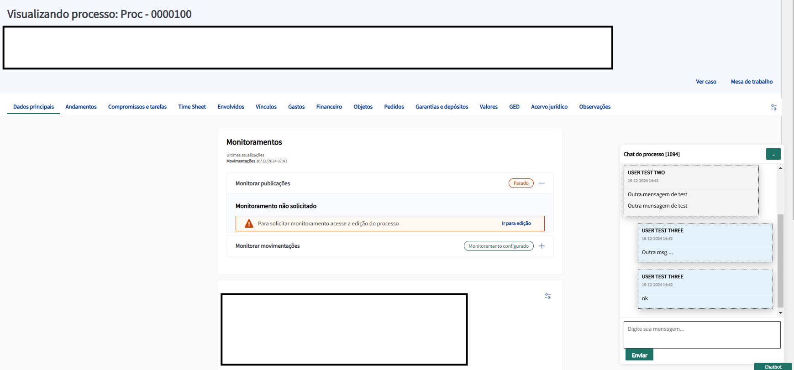

# Extensão do Chrome para Adicionar um Pop-up de Chat aos Casos do Legal One

## Visão Geral
Este projeto fornece uma extensão do Chrome que adiciona dinamicamente um pop-up de chat às páginas de casos do Legal One. O chat é exclusivo para cada caso e é identificado extraindo o ID do caso da URL da página. A extensão se comunica com um servidor backend (middleware) que interage com um banco de dados Firebase para gerenciar os dados do chat.

---

## Funcionalidades
- **Pop-up de Chat Dinâmico:** Adiciona um modal (pop-up) para a funcionalidade de chat às páginas de casos do Legal One.
- **Chat Específico por Caso:** Cada instância de chat está vinculada ao ID exclusivo do caso extraído da URL.
- **Comunicação com o Backend:** A extensão interage com um servidor que atua como middleware entre o pop-up e o banco de dados Firebase.

---

## Demonstração
Aqui está um exemplo do pop-up de chat em ação:



---

## Como Funciona
### Front-End (Extensão do Chrome)
- Os arquivos da extensão estão localizados na pasta `extension`. Esses arquivos precisam ser carregados no Chrome. (Consulte [este guia](https://developer.chrome.com/docs/extensions/mv3/getstarted/) para instruções sobre como carregar extensões no Chrome.)
- O script `content.js` é responsável por renderizar o modal de chat. Ele manipula o DOM da página localmente.
- O pop-up de chat usa o ID do caso, extraído da URL (por exemplo, para `processos/processos/details/1094`, o ID é `1094`), para vincular cada chat a um caso específico.

### Backend (Servidor Middleware)
- O servidor backend é implementado em `db/db.mjs` e atua como uma ponte entre o pop-up e o banco de dados Firebase.
- O servidor lida com requisições de API da extensão, processa os dados e se comunica com o Firebase.

---

## Instruções de Configuração
### 1. Configuração da Extensão do Chrome
1. Navegue até a pasta `extension`.
2. Siga [este guia](https://developer.chrome.com/docs/extensions/mv3/getstarted/) para carregar a extensão no Chrome.

### 2. Configuração do Banco de Dados Firebase
1. Crie um banco de dados no Firebase.
2. Atualize a configuração do banco de dados no arquivo `db/db.mjs`. Adicione os detalhes do seu projeto Firebase:
   ```javascript
   const firebaseConfig = {
       apiKey: "<sua-api-key>",
       authDomain: "<seu-auth-domain>",
       projectId: "<seu-project-id>",
       storageBucket: "<seu-storage-bucket>",
       messagingSenderId: "<seu-messaging-sender-id>",
       appId: "<seu-app-id>"
   };
   ```

### 3. Configure a URL Base da API
- Atualize a variável `baseUrl` no arquivo `content.js` com a URL do seu servidor. Exemplo:
   ```javascript
   const baseUrl = "http://localhost:8000"; // Substitua pela URL do seu servidor
   ```

---

## Executando o Servidor
1. Instale o [Deno](https://deno.land/) para executar o servidor middleware.
2. Navegue até a pasta `db`.
3. Execute o servidor com o seguinte comando:
   ```bash
   deno run --allow-import --allow-read --allow-env --allow-net db.mjs
   ```
4. Certifique-se de que o servidor esteja acessível pela URL especificada em `baseUrl`.

---
